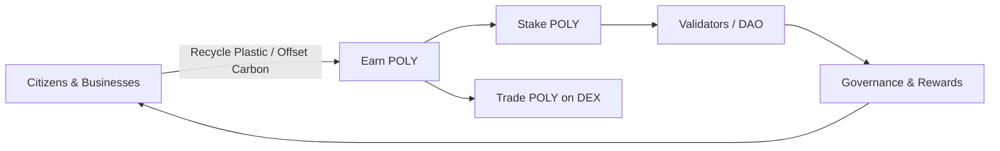

# 🪙 POLY Token

**POLY** is the native utility and rewards token of the **Polymers Network**, powering a circular economy for plastics through blockchain, incentives, and transparency.

---

## 📌 Overview

* **Token Name:** Polymers Token
* **Symbol:** `POLY`
* **Blockchain:** Solana
* **Token Standard:** SPL Token (Solana Program Library)
* **Decimals:** 9
* **Use Cases:**

  * Rewards for recycling & sustainability actions
  * Governance and voting in the Polymers DAO
  * Staking to support validators and earn yield
  * Access to premium features in the Polymers ecosystem
  * Trading on Solana DEXes (Raydium, Jupiter, Orca)

* **CA:**

---

## 🔄 Token Flow



---

## 📊 Tokenomics

* **Total Supply:** `18,440,000,000 POLY`
* **Distribution:**

  * ♻️ Community Rewards (40%) → `7.376B POLY`
  * 🏢 Businesses & Partnerships (20%) → `3.688B POLY`
  * ⚙️ Development & Ecosystem (20%) → `3.688B POLY`
  * 🛡️ Treasury & DAO (15%) → `2.766B POLY`
  * 👥 Team & Advisors (5%) → `922M POLY`

---

## 🛠️ Installation & Usage

### Install SPL Token tools

```bash
npm install @solana/spl-token @solana/web3.js
```

### Example: Fetch POLY balance

```ts
import { Connection, PublicKey } from "@solana/web3.js";

const POLY_MINT = new PublicKey("YOUR_POLY_MINT_ADDRESS");

async function getPolyBalance(wallet: string) {
  const connection = new Connection("https://api.mainnet-beta.solana.com");
  const owner = new PublicKey(wallet);
  const accounts = await connection.getParsedTokenAccountsByOwner(owner, { mint: POLY_MINT });
  
  if (accounts.value.length > 0) {
    return accounts.value[0].account.data.parsed.info.tokenAmount.uiAmount;
  }
  return 0;
}
```

---

## 🌍 Integrations

* **Price Data APIs:**

  * [Jupiter](https://jup.ag/)
  * [Birdeye](https://birdeye.so/)
  * [Dexscreener](https://dexscreener.com/)
  * [Raydium](https://raydium.io/)

* **Wallets Supported:**

  * Phantom
  * Solflare
  * Backpack
  * Base

---

## 📜 License

MIT © 2025 Polymers Network
